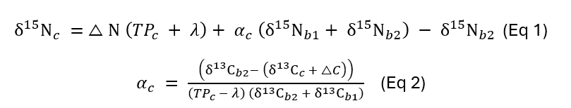
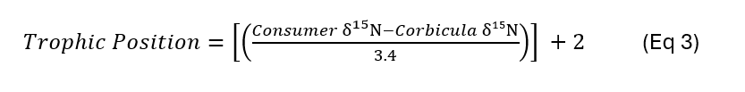
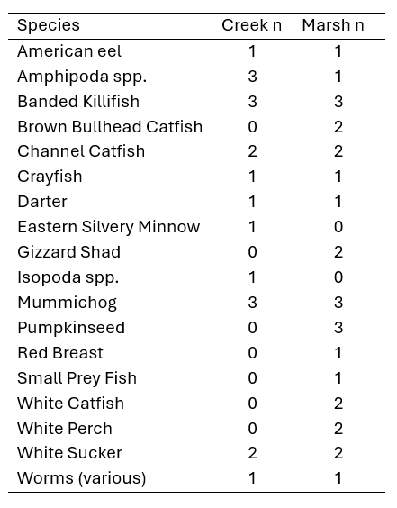
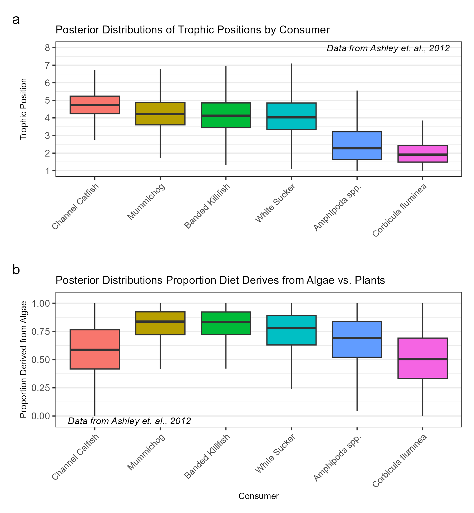
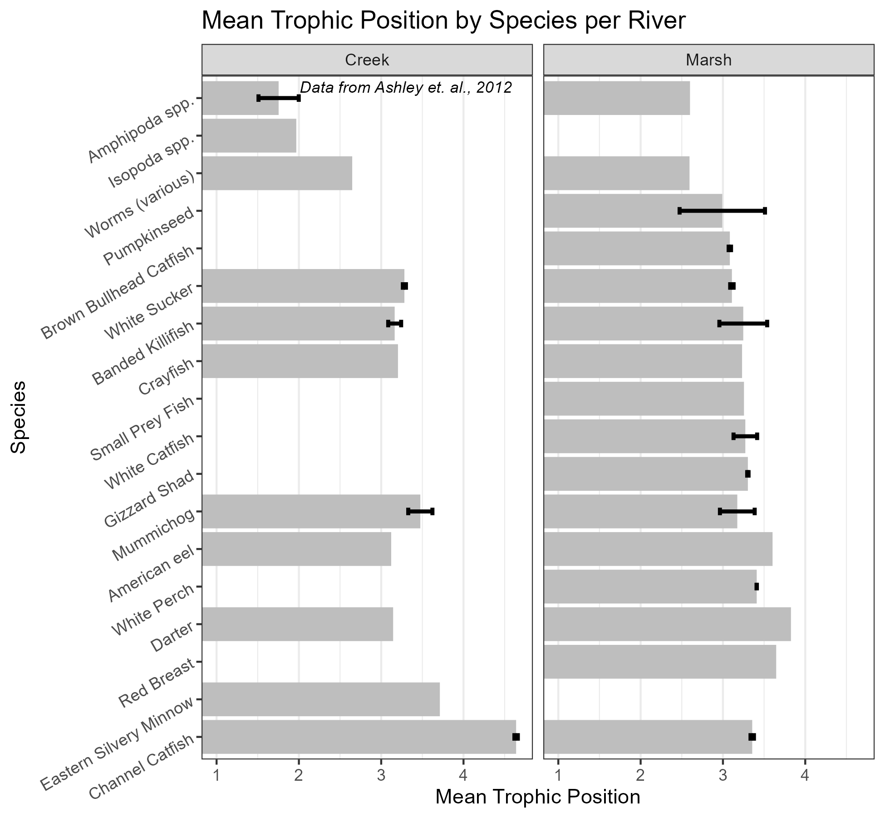

# Isotopes_PASeaGrant
This repository hosts code for stable isotope analyses to assess trophic positions and food web dynamics using δ¹³C and δ¹⁵N. It employs the R packages simmr and tRophicPosition to compare data before and after Northern Snakehead invasion.

# Methods
Stable isotope data were obtained from Ashley et al. (2012) and processed in R (R Core Team, 2017; RStudio Team, 2016). Data were collected from the John Heinz National Wildlife Refuge at Tinicum Marsh in 2007 and 2008 at two sites representing the marsh and Darby Creek within the refuge. The number or replicate samples were not sufficient to fit models to each site individually, thus the Tinicum Marsh here is considered one site.

R package tRophicPosition was used for trophic position estimation using both δ¹³C and δ¹⁵N (Quezada‐Romegialli et al., 2018). For trophic position estimation, baseline groups were defined as “algae” and “plant”. The algae group included both pelagic (n = 4) and benthic algae (n = 2). The plant group included Common Elodea (n = 1), Curly Pondweed (n = 1), Nuphar (n = 4), and Polygonum spp. (n = 2). Consumer species were limited to those species where at least 3 organisms where collected: Corbiculae fluminea (n = 6), Banded Killifish (n = 6), Channel Catfish (n = 4), Mummichog (n = 6), White Sucker (n = 4), and amphipods spp. (n = 4). Trophic discrimination factors (TDFs) for both δ¹³C and δ¹⁵N were estimated using the McCutchan et al. (2003) parameters. 

δ¹⁵Nc and δ¹³Cc are the values of each consumer, δ¹⁵Nb1and δ¹³Cb1 are the values for baseline 1 (algae), and δ¹⁵Nb2 and δ¹³Cb2 are the values for baseline 2 (plants). λ is the trophic position of the baselines. ∆N and ∆C are the TDF for nitrogen and carbon, respectively. αc is the diet proportion from baseline 1 (algae) for each consumer and TPc is the trophic position of each consumer. αc and TPc are fit as posterior distributions simultaneously in a hierarchical Bayesian model with the baselines primary producers trophic position fixed at 1. MCMC parameters were set to 50,000 total iterations with a burn-in of 10,000 iterations, three chains, thinning every 10 iterations, resulting in 5,000 posterior samples per chain. Diagnostic plots were generated for each consumer group to assess model convergence and data quality.

Above, we applied the hierarchical Bayesian methods implemented in tRophicPosition to obtain refined, statistically robust trophic position and diet proportionality estimates that account for uncertainty in both δ¹³C and δ¹⁵N data. Additionally, we employed the simpler, δ¹⁵N‐only approach of Vander Zanden et al. (1997) to include all available species; presenting both analyses strengthens our work by offering complementary evidence and cross-validation of trophic structure. Although, the small number of replicates should always be considered for these methods. This approach adjusts for baseline variability by comparing the δ¹⁵N of consumers to that of a long-lived baseline organism. In our analysis, the bivalve Corbicula fluminea was used as the baseline because it integrates temporal variability in δ¹⁵N from primary production and is assigned a trophic level of 2. For this method an increase of 3.4‰ in δ¹⁵N is considered equivalent to a one trophic level increase (Eq. 3).

Table 1. 18 consumer species were collected during the Ashley et. al. (2012) collection. The number of individuals varied by species and by site location within the John Heinz National Wildlife Refuge at Tinicum Marsh.

# Results
Figure 1. Posterior distributions were fit to (a) the trophic level and (b) the portion of the diet attribuated to baseline 1 (algae) at the John Heinz National Wildlife Refuge at Tinicum Marsh consumers collected by Ashley et. al.  (2012). The model was restricted to species were at least 3 individuals were collected and analyzed for δ¹³C and δ¹⁵N.

Median trophic positions and corresponding α values were estimated for each consumer using a hierarchical Bayesian model. These values were derived from the posterior distributions of TPc and αc (Figure 1). The results reveal clear differences in trophic structure among consumers, with Channel Catfish exhibiting the highest median trophic position (4.74) and Corbicula fluminea the lowest (1.91), indicating variation in fractionation and feeding ecology across the study species. For Channel Catfish, the median trophic position is 4.74 and the median alpha is 0.587; Mummichog, the median trophic position is 4.23 and the median alpha is 0.837; Banded Killifish, the median trophic position is 4.13 and the median alpha is 0.835; White Sucker, the median trophic position is 4.05 and the median alpha is 0.779; Amphipoda spp., the median trophic position is 2.29 and the median alpha is 0.692; and for Corbicula fluminea, the median trophic position is 1.91 and the median alpha is 0.505.

Figure 2. Mean trophic position (and standard deviation) of all species collected by Ashley et. al. (2012). The number of individuals per location varied by species (Table 1). These estimates are not robust owing to the low number of individuals per location.

Using the Vander Zanden et al. (1997) method, the mean trophic positions ranged from as low as 1.75 for Amphipoda spp. (Creek) to as high as 4.64 for Channel Catfish (Creek) (Figure 2). Several species exhibited site‐specific differences between Creek and Marsh. American eel had a higher mean trophic position in Marsh (3.60) than in Creek (3.12), while Channel Catfish were estimated at 4.64 in Creek versus 3.36 in Marsh. Although these results provide a useful baselines, the δ¹⁵N‐only approach is very simplistic and should be used as a reference point for future analysis. Instead, the robust posteriors of the hierarchical Bayesian model (Figure 1) should be used to describe ecological differences with statistical rigor.
